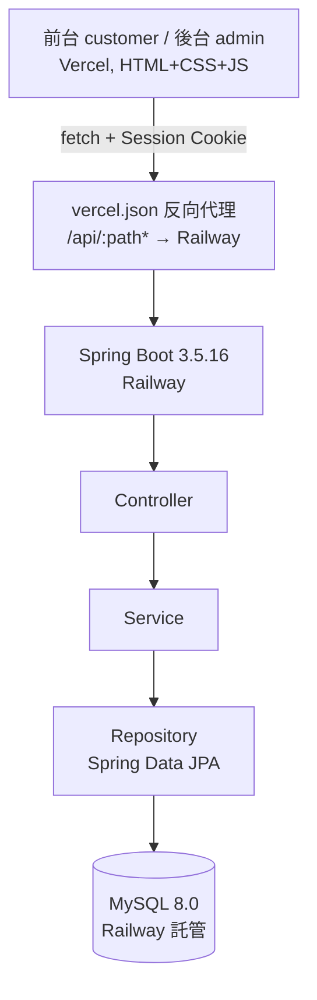
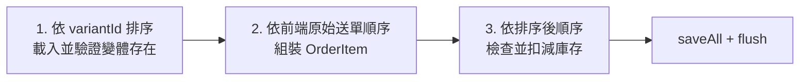
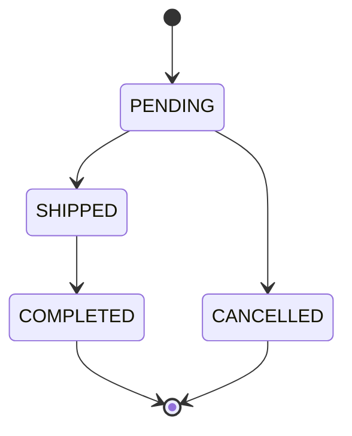
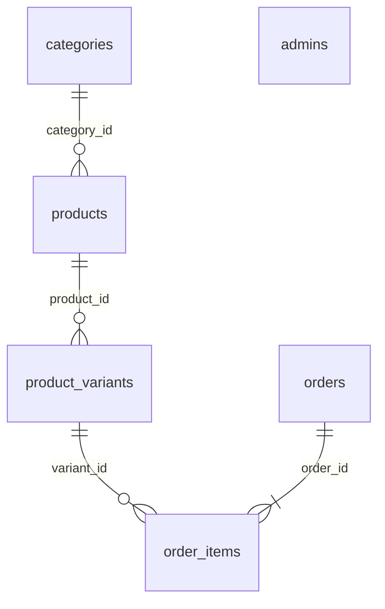

# WishCake｜線上蛋糕訂購系統（後端）

> 支援樂觀鎖防超賣、四狀態訂單流轉的蛋糕線上訂購系統後端 API。實測 60 併發下單，成功訂單數等於可用庫存，庫存零超賣。

[](https://cake-ordering-frontend.vercel.app/customer/index.html)  [](https://github.com/yenkemiel/cake-ordering-backend/actions)  []()  []()


| | 連結 |
|---|---|
| 前台 Demo | [連結](https://cake-ordering-frontend.vercel.app/customer/index.html) |
| 後台管理 Demo | [連結](https://cake-ordering-frontend.vercel.app/admin/login.html)（測試帳密請見履歷專案成就區） |
| Swagger API 文件 | [連結](https://cake-ordering-backend-production.up.railway.app/swagger-ui.html) |
|線上蛋糕訂購系統文件總覽|[連結](https://hackmd.io/@Ug5CetXYQUGf_XJEfWCFHA/BJ1fr-tVGx)

## Demo

#### 商品一覽


#### 後台訂單管理


#### 防超賣併發測試結果
情境一：單商品搶購 30 併發

情境二：跨商品交叉下單 60 併發


## 專案定位

WishCake 為三人團隊五週完成的線上蛋糕訂購系統。負責後端系統開發、API 設計、資料庫設計，以及庫存防超賣機制與併發測試。

本專案的技術重點並非單純 CRUD，而是處理多人同時購買同一商品時的庫存一致性問題，因此以 JPA `@Version` 樂觀鎖搭配併發測試驗證系統行為。

### 我的負責範圍

#### 後端工程
- 後端 API 設計與開發（Controller → Service → Repository 三層架構）
- MySQL 資料庫設計（ERD、Flyway migration、索引設計）
- 商品、訂單、分類、管理員等核心模組開發
- 樂觀鎖防超賣機制設計與死鎖排查
- 併發測試情境設計與結果驗證

#### 規格與專案文件
- 需求規格書撰寫與維護，將產品需求轉化為可執行的功能規格（FR 編號、狀態轉換表、API 規格）
- 主導開發日誌、會議記錄、技術債清單等專案文件的建立與持續更新，作為團隊決策留存依據
- 前後端 API 規格協調，確保前後台資料一致
- 專案文件索引：[線上蛋糕訂購系統文件總覽](https://hackmd.io/@Ug5CetXYQUGf_XJEfWCFHA/BJ1fr-tVGx)
## 核心功能

| 模組 | 說明 |
|---|---|
| Common | 統一回應格式 `ApiResponse<T>`、全域例外處理 `GlobalExceptionHandler`、健康檢查端點 |
| Admin | 管理員登入／登出，Session Cookie 驗證，`AdminSessionInterceptor` 保護所有 `/api/admin/**` 路徑 |
| Category | 分類 CRUD、拖曳排序，刪除前檢查是否仍有商品引用 |
| Product | Product–Variant 兩層模型，商品共用基本資料、各尺寸獨立管理價格／庫存／上下架狀態 |
| Order | 訪客下單（免登入）、訂單編號＋電話查詢、後台訂單列表與狀態切換、四狀態流轉 |

## 系統架構

前後端分離、三層架構（Controller → Service → Repository）：



前端與後端部署在不同網域（Vercel／Railway），Session Cookie 跨網域傳遞原本會因瀏覽器 SameSite 政策被擋下；解法是在 Vercel 設定 `vercel.json` 反向代理，讓瀏覽器視角上請求仍是同源，同時後端 Session Cookie 設定 `SameSite=None; Secure=true`。

## 技術亮點

**樂觀鎖防超賣**

`ProductVariant` 標注 `@Version`，下單扣庫存時若版本衝突，Hibernate 拋出 `ObjectOptimisticLockingFailureException`，統一轉譯為 `409 STOCK_VERSION_CONFLICT`。相較悲觀鎖，樂觀鎖不持有資料庫鎖等待，結構上避免了死鎖問題。

`createOrder()` 採三階段鎖排序，解決 Hibernate 持久化上下文因物件載入順序不一致造成的死鎖：



**併發壓測實測數據**（`oversell-demo.html`，呼叫真實 `POST /api/orders`）

| 情境 | 併發請求數 | 初始庫存 | 成功 | 庫存不足 | 樂觀鎖衝突 | DB 鎖等待 |
|---|---:|---:|---:|---:|---:|---:|
| 單商品搶購 | 30 | 10 |6 | 0 | 24 | 0 |
| 跨商品交叉下單 | 60 | 各 10（合計 20） | 10 | 37 | 73 | 0 |

兩組情境成功訂單數皆等於初始庫存、庫存從未變成負數，且全程沒有出現資料庫鎖等待，驗證了樂觀鎖在高併發下的正確性與效能。

**訂單狀態機**



嚴格單向流轉，非法轉換一律回 `409`。取消訂單時會將對應變體庫存回補。

## ERD



- 商品採 **Product–Variant 兩層模型**：`products` 存共同資訊，`product_variants` 存各尺寸的價格、庫存、上下架狀態、樂觀鎖版本，上下架作用於變體層級，同商品不同尺寸可各自獨立上下架。
- `order_items` 儲存下單當下的商品名稱／尺寸／單價快照，即使之後商品內容變動也不影響歷史訂單。
- 有意不建立 `cart_items`（購物車僅存在前端 `localStorage`）與 `order_addons`（加購配件視為「配件」分類下的一般商品）。

## 技術棧

| 分類 | 技術 |
|---|---|
| 語言／框架 | Java 21、Spring Boot 3.5.16、Spring Data JPA (Hibernate) |
| 資料庫 | MySQL 8.0、Flyway |
| 認證 | Session Cookie（`spring-security-crypto` BCrypt，無 Spring Security filter chain、無 JWT） |
| API 文件 | springdoc-openapi |
| 測試 | JUnit5、Mockito、Testcontainers、Checkstyle |
| 部署／CI | Docker Compose（本機 MySQL）、Railway、Vercel、GitHub Actions |

## 本機啟動

```bash
# 1. 啟動本機 MySQL
docker compose up -d

# 2. 設定環境變數（複製 .env.example 為 .env 並填入資料庫連線、admin 初始帳密等資訊）
cp .env.example .env

# 3. 啟動後端（Flyway 會在啟動時自動套用 db/migration 下的 schema，不需手動執行 SQL）
mvn spring-boot:run

# 4. 匯入 Postman collection 測試
# 檔案位置：postman/cake-ordering-backend_postman_collection.json
```

## API 文件

Swagger UI：`/swagger-ui.html`，所有端點依 FR 編號標註 `@Operation summary`（例如 `[FR-ORD-001] 建立訂單`），方便對照後端需求書逐條檢視。

## 測試

- 核心 Service 單元測試（`OrderService.createOrder()` 正常建立／庫存不足／樂觀鎖衝突、狀態流轉、商品軟刪除連動變體等）
- Testcontainers 整合測試：真實 MySQL 容器驗證併發下單、SQL 正確性
- Postman collection：涵蓋所有 API 的正常與異常情境
- GitHub Actions CI：push／PR 自動跑 `mvn verify`

## 設計取捨與已知限制

| 限制 | 原因／未來方向 |
|---|---|
| 未串接第三方金流 | 專題範圍限制，後續可串接綠界／Stripe |
| 購物車使用 localStorage | 採訪客結帳設計，簡化免登入購物體驗，未建立購物車持久化 API |
| 單一管理員角色 | MVP 範圍取捨，優先做扎實樂觀鎖與併發測試，後續可加入角色分層權限 |
| 圖片使用 URL 字串 | 未實作檔案上傳與物件儲存服務，正式產品會需要 S3／Cloudinary 等方案 |

## 技術反思與後續規劃

一開始沒意識到 Hibernate 持久化上下文的物件載入順序也會造成死鎖，排查後發現「鎖排序」是解決這類問題的通用手法，不只適用資料庫鎖，也適用於應用層物件操作順序。

Session Cookie 跨網域也是前後端分離部署的常見痛點，如果重來一次，會在專案初期就把跨網域 CORS／Cookie 問題排進技術驗證清單，而不是等到部署階段才發現。

下一版規劃：角色分層權限、串接真實金流、圖片上傳功能，皆已記錄於技術債清單，作為第二階段的明確範圍。

## 團隊分工

三人團隊，五週 sprint：
- **後端（我）**：獨立完成整個後端系統，含 API 設計、資料庫、樂觀鎖防超賣機制設計與併發測試
- **前端 customer 頁面**：另一位組員負責
- **前端 admin 頁面**：另一位組員負責